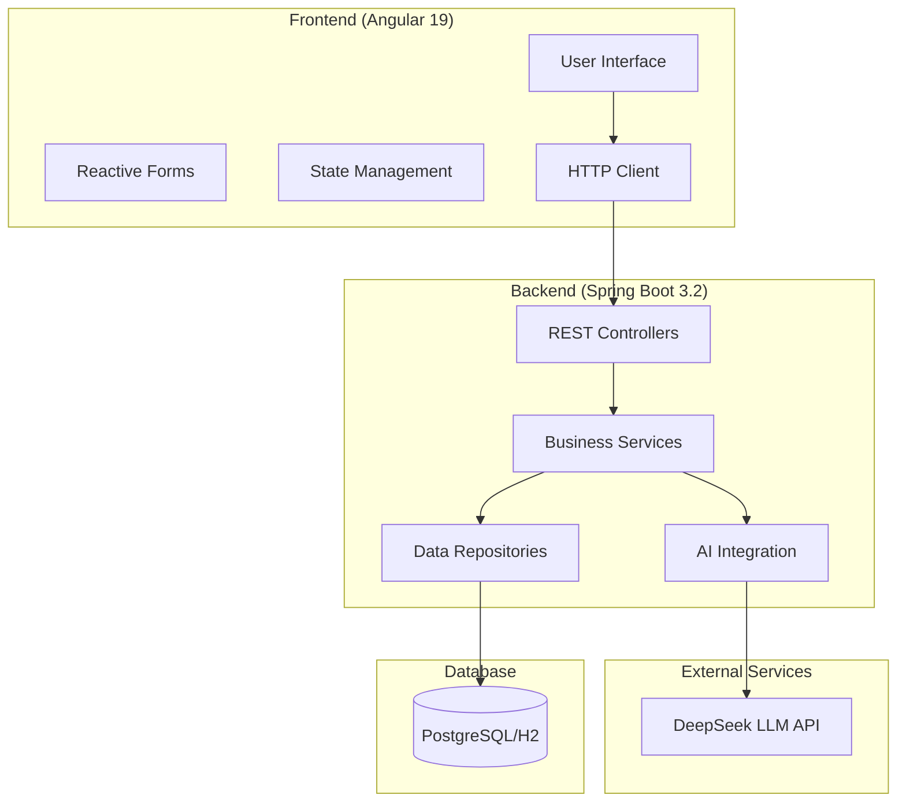

# 🥗 AI-Powered Diet Planner

[](https://spring.io/projects/spring-boot)
[](https://angular.io/)
[](https://openjdk.org/)
[](https://www.typescriptlang.org/)
[](https://www.deepseek.com/)
[](LICENSE)

> A comprehensive, AI-powered diet planning application that generates personalized meal plans using Large Language Models (LLM) and modern web technologies.

## 🌟 Features

### 🤖 **AI-Powered Meal Planning**
- **Personalized Diet Plans**: Generate custom 7-day meal plans based on individual requirements
- **Smart Recommendations**: AI considers dietary restrictions, health goals, allergies, and preferences
- **Comprehensive Output**: Detailed meal plans, nutritional analysis, shopping lists, and meal prep tips
- **Multiple Cuisine Support**: Wide range of cuisine preferences and dietary patterns

### 📊 **Advanced Analytics**
- **BMI Calculator**: Real-time Body Mass Index calculation with health category classification
- **Calorie Estimation**: Automatic daily calorie requirement calculation using Harris-Benedict equation
- **Nutritional Breakdown**: Detailed macronutrient and micronutrient analysis
- **Progress Tracking**: User rating system and feedback collection

### 🔧 **Modern Architecture**
- **Microservices Ready**: Clean, layered architecture supporting future scaling
- **Reactive Programming**: RxJS-based state management for optimal user experience
- **Responsive Design**: Mobile-first, progressive web application
- **Real-time Validation**: Comprehensive form validation with instant feedback

### 🛡️ **Enterprise Security**
- **Input Validation**: Comprehensive server-side and client-side validation
- **Error Handling**: Global exception handling with structured error responses
- **CORS Configuration**: Secure cross-origin resource sharing
- **Data Sanitization**: Protection against XSS and injection attacks

## 🏗️ Architecture Overview



## 🚀 Quick Start

### Prerequisites

- **Java 17+** - [Download OpenJDK](https://openjdk.org/)
- **Node.js 18+** - [Download Node.js](https://nodejs.org/)
- **Maven 3.8+** - [Download Maven](https://maven.apache.org/)
- **Git** - [Download Git](https://git-scm.com/)

### 🔧 Backend Setup

1. **Clone the repository**
   ```bash
   git clone https://github.com/yourusername/diet-planner-llm.git
   cd diet-planner-llm
   ```

2. **Navigate to backend directory**
   ```bash
   cd diet-planner-backend
   ```

3. **Configure application properties**
   ```bash
   # Copy the example configuration
   cp src/main/resources/application-example.yml src/main/resources/application.yml
   
   # Edit with your DeepSeek API key
   nano src/main/resources/application.yml
   ```

4. **Set your DeepSeek API key**
   ```yaml
   deepseek:
     api:
       key: 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
       url: https://api.deepseek.com
   ```

5. **Run the application**
   ```bash
   # Development mode
   mvn spring-boot:run -Dspring.profiles.active=dev
   
   # The backend will start on http://localhost:8080
   ```

### 🎨 Frontend Setup

1. **Navigate to frontend directory**
   ```bash
   cd ../diet-planner-frontend
   ```

2. **Install dependencies**
   ```bash
   npm install
   ```

3. **Start development server**
   ```bash
   ng serve
   
   # The frontend will start on http://localhost:4200
   ```

### 🐳 Docker Setup (Recommended)

1. **Using Docker Compose**
   ```bash
   # Build and start all services
   docker-compose up --build
   
   # Access the application
   # Frontend: http://localhost:4200
   # Backend: http://localhost:8080
   # Database: localhost:5432
   ```

2. **Individual container builds**
   ```bash
   # Backend
   cd diet-planner-backend
   docker build -t diet-planner-backend .
   docker run -p 8080:8080 diet-planner-backend
   
   # Frontend
   cd ../diet-planner-frontend
   docker build -t diet-planner-frontend .
   docker run -p 4200:80 diet-planner-frontend
   ```

## 📱 Usage Guide

### 🍽️ Generating a Diet Plan

1. **Access the application** at `http://localhost:4200`

2. **Fill out the diet requirements form:**
   - **Dietary Restrictions**: Vegetarian, Vegan, Keto, etc.
   - **Health Goals**: Weight loss, muscle gain, maintenance
   - **Personal Information**: Age, weight, height, activity level
   - **Optional Details**: Allergies, cuisine preferences, budget

3. **Submit the form** and wait for AI generation (10-30 seconds)

4. **Review your personalized plan:**
   - 7-day detailed meal plan
   - Nutritional analysis
   - Shopping list
   - Meal preparation tips

5. **Rate and provide feedback** to improve future recommendations

### 📊 Features Overview

- **Real-time BMI calculation** as you enter your measurements
- **Calorie estimation** based on your activity level
- **Form validation** with helpful error messages
- **Responsive design** works on all devices
- **Offline capability** (PWA features)

## 🧪 Testing

### Backend Tests
```bash
cd diet-planner-backend

# Run all tests
mvn test

# Run with coverage
mvn clean test jacoco:report

# Integration tests
mvn verify -P integration-tests
```

### Frontend Tests
```bash
cd diet-planner-frontend

# Unit tests
ng test

# E2E tests
ng e2e

# Test coverage
ng test --code-coverage
```

## 📚 API Documentation

### 🔌 REST Endpoints

#### Diet Plans
- `POST /api/v1/diet-plans` - Generate new diet plan
- `GET /api/v1/diet-plans/{id}` - Get specific diet plan
- `GET /api/v1/diet-plans/user/{userId}` - Get user's diet plans
- `PUT /api/v1/diet-plans/{id}/rating` - Update plan rating
- `DELETE /api/v1/diet-plans/{id}` - Delete diet plan

#### Health & Monitoring
- `GET /api/v1/diet-plans/health` - Health check
- `GET /actuator/health` - Application health
- `GET /actuator/metrics` - Application metrics

### 📋 Request/Response Examples

**Generate Diet Plan Request:**
```json
{
  "dietaryRestrictions": "Vegetarian",
  "healthGoals": "Weight loss",
  "age": 28,
  "weight": 70.0,
  "height": 175.0,
  "activityLevel": "Moderately active",
  "allergies": "Nuts",
  "preferredCuisine": "Mediterranean",
  "targetCalories": 1800
}
```

**Diet Plan Response:**
```json
{
  "id": 1,
  "dietPlan": "Detailed 7-day meal plan...",
  "nutritionalInfo": "Daily nutrition breakdown...",
  "recommendations": "Health recommendations...",
  "shoppingList": "Organized shopping list...",
  "success": true,
  "message": "Diet plan generated successfully",
  "createdAt": "2024-01-15T10:30:00Z"
}
```

## 🗄️ Database Schema

### Core Tables

```sql
-- Users table
CREATE TABLE users (
    id BIGSERIAL PRIMARY KEY,
    username VARCHAR(50) UNIQUE NOT NULL,
    email VARCHAR(100) UNIQUE NOT NULL,
    password_hash VARCHAR(255) NOT NULL,
    created_at TIMESTAMP DEFAULT CURRENT_TIMESTAMP,
    active BOOLEAN DEFAULT TRUE
);

-- Diet plans table
CREATE TABLE diet_plans (
    id BIGSERIAL PRIMARY KEY,
    user_id BIGINT REFERENCES users(id),
    meal_plan TEXT NOT NULL,
    nutritional_info TEXT,
    recommendations TEXT,
    shopping_list TEXT,
    dietary_restrictions VARCHAR(500),
    health_goals VARCHAR(500),
    age INTEGER CHECK (age > 0 AND age <= 120),
    weight DECIMAL(5,2) CHECK (weight > 0),
    height DECIMAL(5,2) CHECK (height > 0),
    created_at TIMESTAMP DEFAULT CURRENT_TIMESTAMP,
    updated_at TIMESTAMP DEFAULT CURRENT_TIMESTAMP,
    active BOOLEAN DEFAULT TRUE
);

-- Indexes for performance
CREATE INDEX idx_diet_plans_user_id ON diet_plans(user_id);
CREATE INDEX idx_diet_plans_created_at ON diet_plans(created_at);
CREATE INDEX idx_diet_plans_active ON diet_plans(active);
```

## 🚀 Deployment

### 🌐 Production Deployment

#### AWS Deployment
```bash
# Backend on Elastic Beanstalk
eb init diet-planner-backend
eb create production
eb deploy

# Frontend on S3 + CloudFront
ng build --prod
aws s3 sync dist/ s3://your-bucket-name
aws cloudfront create-invalidation --distribution-id YOUR_DIST_ID --paths "/*"
```

#### Docker Production
```bash
# Build production images
docker build -t diet-planner-backend:prod -f Dockerfile.prod ./diet-planner-backend
docker build -t diet-planner-frontend:prod -f Dockerfile.prod ./diet-planner-frontend

# Deploy with Docker Compose
docker-compose -f docker-compose.prod.yml up -d
```

### 🔧 Environment Variables

#### Backend
```bash
# Application
SPRING_PROFILES_ACTIVE=prod
SERVER_PORT=8080

# Database
DATABASE_URL=jdbc:postgresql://localhost:5432/dietplanner
DB_USERNAME=dietplanner_user
DB_PASSWORD=secure_password

# DeepSeek API
DEEPSEEK_API_KEY=your-production-api-key
DEEPSEEK_API_URL=https://api.deepseek.com

# Security
CORS_ALLOWED_ORIGINS=https://yourdomain.com
```

#### Frontend
```bash
# API Configuration
API_BASE_URL=https://api.yourdomain.com
PRODUCTION=true

# Features
ENABLE_ANALYTICS=true
ENABLE_NOTIFICATIONS=true
```

## 🤝 Contributing

We welcome contributions! Please see our [Contributing Guide](CONTRIBUTING.md) for details.

### Development Workflow

1. **Fork the repository**
2. **Create a feature branch**
   ```bash
   git checkout -b feature/amazing-feature
   ```
3. **Make your changes**
4. **Add tests for new functionality**
5. **Commit your changes**
   ```bash
   git commit -m 'Add amazing feature'
   ```
6. **Push to your branch**
   ```bash
   git push origin feature/amazing-feature
   ```
7. **Open a Pull Request**

### Code Style

- **Backend**: Follow [Google Java Style Guide](https://google.github.io/styleguide/javaguide.html)
- **Frontend**: Follow [Angular Style Guide](https://angular.io/guide/styleguide)
- **Use Prettier** for consistent formatting
- **Write meaningful commit messages**

### Testing Requirements

- **Minimum 80% code coverage** for new features
- **Unit tests** for all business logic
- **Integration tests** for API endpoints
- **E2E tests** for critical user flows

## 📊 Performance & Monitoring

### Key Metrics
- **Response Time**: < 2 seconds for diet plan generation
- **Uptime**: 99.9% availability target
- **Throughput**: 1000+ requests per minute
- **Error Rate**: < 1% of total requests

### Monitoring Stack
- **Application Metrics**: Spring Boot Actuator + Micrometer
- **Logging**: Structured logging with Logback
- **Health Checks**: Custom health indicators
- **Performance**: JVM metrics and database connection pooling

## 🔧 Technology Stack

### Backend
| Technology | Version | Purpose |
|------------|---------|---------|
| Java | 17+ | Core programming language |
| Spring Boot | 3.2+ | Application framework |
| Spring Data JPA | 3.2+ | Data persistence |
| Spring Security | 6.2+ | Security framework |
| PostgreSQL | 15+ | Production database |
| H2 | 2.2+ | Development database |
| Maven | 3.8+ | Build tool |
| JUnit 5 | 5.10+ | Testing framework |

### Frontend
| Technology | Version | Purpose |
|------------|---------|---------|
| Angular | 19 | Frontend framework |
| TypeScript | 5.6+ | Programming language |
| RxJS | 7.8+ | Reactive programming |
| Angular Material | 19 | UI components |
| SCSS | - | Styling |
| Karma/Jasmine | - | Testing |

### DevOps & Tools
| Technology | Purpose |
|------------|---------|
| Docker | Containerization |
| Docker Compose | Local development |
| GitHub Actions | CI/CD pipeline |
| SonarQube | Code quality |
| NGINX | Reverse proxy |

## 🐛 Troubleshooting

### Common Issues

#### Backend Issues

**Problem**: Application fails to start with database connection error
```bash
# Solution: Check database connection
# 1. Verify PostgreSQL is running
pg_isready -h localhost -p 5432

# 2. Check connection string in application.yml
# 3. Verify database exists and user has permissions
```

**Problem**: DeepSeek API calls failing
```bash
# Solution: Verify API key and connectivity
# 1. Check API key in application.yml
# 2. Test API connectivity
curl -H "Authorization: Bearer YOUR_API_KEY" https://api.deepseek.com/chat/completions

# 3. Check rate limits and usage
```

#### Frontend Issues

**Problem**: CORS errors when calling backend
```bash
# Solution: Check CORS configuration
# 1. Verify backend CORS settings in WebConfig.java
# 2. Check frontend API base URL in environment.ts
# 3. Ensure backend is running on correct port
```

**Problem**: Build errors with Angular 19
```bash
# Solution: Update dependencies
npm update
npm audit fix

# Clear cache
npm cache clean --force
rm -rf node_modules package-lock.json
npm install
```

### Getting Help

1. **Check the [Issues](https://github.com/yourusername/diet-planner-llm/issues)** for known problems
2. **Search [Stack Overflow](https://stackoverflow.com)** for similar issues
3. **Create a new issue** with detailed error logs and steps to reproduce
4. **Join our [Discord community](https://discord.gg/yourserver)** for real-time help

## 📄 License

This project is licensed under the MIT License - see the [LICENSE](LICENSE) file for details.

## 🙏 Acknowledgments

- **DeepSeek AI** for providing the LLM API
- **Spring Boot Team** for the excellent framework
- **Angular Team** for the powerful frontend framework
- **Open Source Community** for inspiration and contributions

## 🔮 Roadmap

### Version 2.0 (Planned)
- [ ] **User Authentication & Profiles**
- [ ] **Meal Plan Sharing & Community Features**
- [ ] **Mobile App (React Native)**
- [ ] **Integration with Fitness Trackers**
- [ ] **Advanced Analytics Dashboard**

### Version 2.1 (Future)
- [ ] **Multi-language Support**
- [ ] **Grocery Delivery Integration**
- [ ] **Recipe Video Integration**
- [ ] **Nutritionist Consultation Booking**
- [ ] **AI-Powered Progress Tracking**

## 📞 Contact

**Project Maintainer**: Risenga Sono  
**Email**: sonosengi@gmail.com 
**LinkedIn**: [Your LinkedIn Profile](https://linkedin.com/in/yourprofile)  
**GitHub**: [@SengiSliko](https://github.com/SengiSliko)  

**Project Link**: [https://github.com/SengiSliko/DIetLLM](https://github.com/SengiSliko/DIetLLM)

---

<div align="center">

**⭐ Star this repository if you found it helpful!**


Made with ❤️ by [Sengi Sono](https://github.com/SengiSliko)

</div>